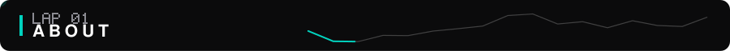
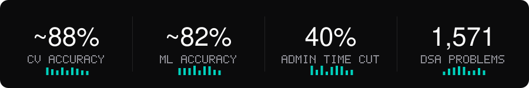
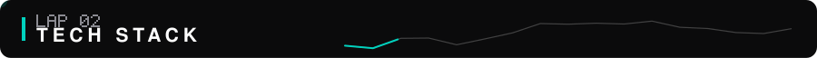
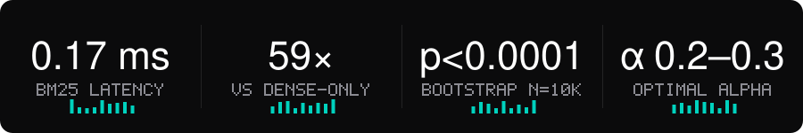
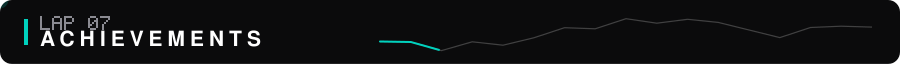
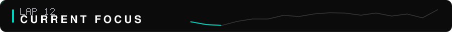

<div align="center">



<a href="https://github.com/AnmolAgarwal4">
  
</a>

<br/><br/>

<a href="https://anmolagarwal4.github.io/"></a>
<a href="https://linkedin.com/in/anmol325/"></a>
<a href="mailto:anmolagarwal325@gmail.com"></a>
<a href="https://lurox.netlify.app"></a>


</div>

<br/>



I build and ship **AI systems end-to-end** — from model training and retrieval to REST APIs and cloud deployment — and I care more about things that run in production than things that live in notebooks. B.Tech CSE (Hons.) student, class of 2028.



- 🔎 &nbsp;**First-author preprint (cs.IR, in submission)** — *Lurox*, a hybrid RAG system with a custom BM25 index written in C
- 🧠 &nbsp;CV/ML systems at **~88% attribute-detection accuracy on 10,000+ images**, sub-2s latency
- 🌐 &nbsp;Shipped **Grokked.in** and a **production website for a defence-tech/UAV startup** (freelance, 2026)
- 🏢 &nbsp;**Software Engineering Intern @ IBM** — Flask, SQL, REST APIs, role-based access control
- 🚀 &nbsp;Product-engineering mindset: scale, latency, and the person on the other end

> **Open to:** AI/ML & Software Engineering internships · research collaboration · open source

<br/>



<div align="center">

<br/>
<br/>
<br/>


</div>

<br/>


| Domain | What I've built with it |
|:--|:--|
| **RAG / LLMs** | Hybrid BM25 + dense retrieval, α-tunable fusion, grounded Llama-3.3-70B generation with zero factual contradictions across evaluated queries — no fine-tuning |
| **Information Retrieval** | Custom BM25 inverted index in C · 0.17 ms median latency · ~59× faster than dense-only · 65,899-posting index |
| **Computer Vision** | OpenCV + GAN pipeline · ~88% attribute-detection accuracy · 10,000+ images |
| **Machine Learning** | scikit-learn classifiers · ~82% accuracy on 1,000+ records · Pandas · Streamlit dashboards |
| **Deep Learning** | PyTorch · sentence-transformers · MiniLM 384-dim embeddings |
| **Deployment** | AWS (EC2, Lambda, S3, API Gateway, IAM, CloudWatch) · Docker · Hugging Face Spaces · Netlify |

<br/>


### 📄 Lurox: A Sub-millisecond Hybrid Retrieval System with Grounded LLM Generation
*First-author preprint (cs.IR), in submission · Jan 2026 – Present*



Built end-to-end from first principles — **~1,500 LOC with zero external IR libraries**: a custom BM25 inverted index in C, dense MiniLM retrieval, α-tunable fusion, and grounded Llama-3.3-70B generation.

- **Finding:** retrieval diversity peaks at **α = 0.2–0.3**, an objective distinct from accuracy-optimal tuning — validated with paired bootstrap testing (n = 10,000, p < 0.0001)
- **Grounding:** prompt-level grounding produced zero factual contradictions across evaluated queries, no fine-tuning
- **Stack:** `C` `Python` `FastAPI` `PyTorch` `sentence-transformers` `Llama-3.3-70B`

[**Live demo ↗**](https://lurox.netlify.app) &nbsp;·&nbsp; [**Source ↗**](https://github.com/AnmolAgarwal4/Lurox)

<br/>


<details open>
<summary><b>📚 &nbsp;Grokked.in — DSA platform with an LLM-powered AI tutor</b> &nbsp;<sub>Nov 2025 – Present</sub></summary>

<br/>

| | |
|:--|:--|
| **Stack** | Next.js · React · Node.js · PostgreSQL · REST APIs · LLM |
| **Scale** | **1,571 DSA problems** across **4 languages** |
| **Architecture** | REST APIs + PostgreSQL progress tracking for reliable, scalable user progress management |
| **Link** | [grokked.in ↗](https://grokked.in) |

</details>

<details>
<summary><b>👗 &nbsp;Snap2Style — CV + GAN outfit recommender</b> &nbsp;<sub>Aug – Sep 2025</sub></summary>

<br/>

| | |
|:--|:--|
| **Stack** | Python · OpenCV · PyTorch · GAN |
| **Scale** | **10,000+ images** |
| **Performance** | **~88% attribute-detection accuracy** · **sub-2s** end-to-end latency |
| **Source** | [GitHub ↗](https://github.com/AnmolAgarwal4) |

</details>

<details>
<summary><b>🧠 &nbsp;NeuroTrace — cognitive data intelligence platform</b> &nbsp;<sub>Oct – Dec 2025</sub></summary>

<br/>

| | |
|:--|:--|
| **Stack** | Python · scikit-learn · Streamlit · Pandas |
| **Scale** | **1,000+ records** |
| **Performance** | **~82% accuracy** |
| **Impact** | Dashboards cut manual analysis time by **~50%** for non-technical analysts |
| **Source** | [GitHub ↗](https://github.com/AnmolAgarwal4) |

</details>

<details>
<summary><b>🏥 &nbsp;Hospital Management System</b> &nbsp;<sub>IBM · Jun – Aug 2025</sub></summary>

<br/>

| | |
|:--|:--|
| **Stack** | Python · Flask · SQL · REST APIs |
| **Scale** | Workflows across **500+ patient records** |
| **Performance** | Query optimization + automated scheduling cut admin handling time by **40%** |
| **Security** | Role-based access control |
| **Impact** | Usable by non-technical clinical staff with **zero training** |
| **Source** | [GitHub ↗](https://github.com/AnmolAgarwal4) |

</details>

<br/>


### 🛠️ Freelance Web Developer &nbsp;·&nbsp; Self-employed
`May – Aug 2026` · `Remote`

- Shipped a **production website for a defence-tech/UAV startup** — 6 UAV platforms, 240+ structured specification fields
- Architected a **reusable product system**: one shared template + URL-parameter routing replaces hand-coded product pages
- Built custom **SVG/CSS radar animations** and an **accessible product modal** (focus trapping, ESC-to-close, ARIA roles, dynamic `mailto` enquiries) across 3 responsive breakpoints

`WordPress` `Elementor` `Vanilla JS` `SVG/CSS` `Accessibility`

### 🏢 Software Engineering Intern &nbsp;·&nbsp; IBM
`Jun – Aug 2025` · `Remote`

- Implemented a full-stack **Hospital Management System** (Python/Flask, SQL, REST APIs, RBAC) across **500+ patient records**
- Optimized APIs and SQL workflows — **40% less** administrative handling time
- Coordinated requirements with technical and clinical stakeholders

`Python` `Flask` `SQL` `REST APIs` `RBAC`

<br/>



| | |
|:--|:--|
| 📄 **First-author preprint** | *Lurox* (cs.IR) — in submission |
| ☁️ **AWS Skill Builder Bootcamp (UPES)** | **Top 10 of 1,000+** participants (top 1%) |
| 🏆 **Hackathon finalist** | **Top 6 of 62** teams (top 10%) at a university-level hackathon |
| 📖 **IELTS** | Overall **Band 7.0** (C1) |

<br/>


<div align="center">


</div>

<br/>


<div align="center">

<a href="https://leetcode.com/u/Anmol325/"></a>

</div>

<br/>


<div align="center">


<br/>

<br/>


<picture>
  <source media="(prefers-color-scheme: dark)" srcset="https://raw.githubusercontent.com/AnmolAgarwal4/AnmolAgarwal4/output/github-contribution-grid-snake-dark.svg"/>
  <source media="(prefers-color-scheme: light)" srcset="https://raw.githubusercontent.com/AnmolAgarwal4/AnmolAgarwal4/output/github-contribution-grid-snake.svg"/>
  
</picture>

</div>

<br/>



```yaml
anmol_agarwal:
  building:  [ "Lurox — preprint (cs.IR), in submission", "Grokked.in — DSA platform + AI tutor" ]
  learning:  [ distributed_systems, advanced_rag, mlops ]
  exploring: [ llm_fine_tuning, vector_databases, system_design ]
  open_to:   [ ai_ml_internships, swe_roles, research, open_source ]
```

<br/>


<div align="center">

<a href="mailto:anmolagarwal325@gmail.com"></a>
<a href="https://linkedin.com/in/anmol325/"></a>
<a href="https://github.com/AnmolAgarwal4"></a>
<a href="https://anmolagarwal4.github.io/"></a>

<br/><br/>


</div>
